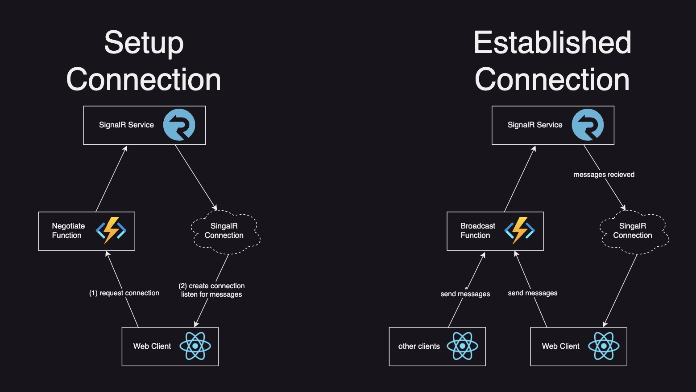

# Azure SignalR Service Intro

This project is a quickstart on how to use the Azure SignalR Service with a web project. This is a companion to my post [Azure SignalR Service Intro](). The implementation here is meant to be ran locally, and you'll have to change things like URLs if you decide to take next steps and deploy it into a production environment. The frontend framework used in the example is NextJs, but the pattern could also be implemented with other frameworks.

The example that is created here was originally created with the [Azure Tutorial](https://learn.microsoft.com/en-us/azure/azure-functions/functions-run-local?tabs=macos%2Cisolated-process%2Cnode-v4%2Cpython-v2%2Chttp-trigger%2Ccontainer-apps&pivots=programming-language-javascript#install-the-azure-functions-core-tools).

The `functions` folder has the Azure Functions that you can use in a sample project.

The `website` folder has a website with a client setup to call localhost URLs to connect to a SignalR instance.